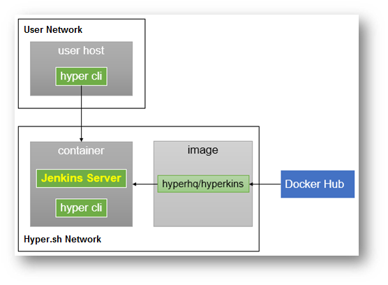
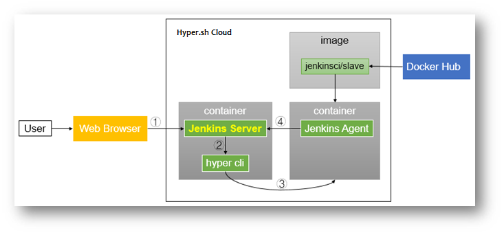
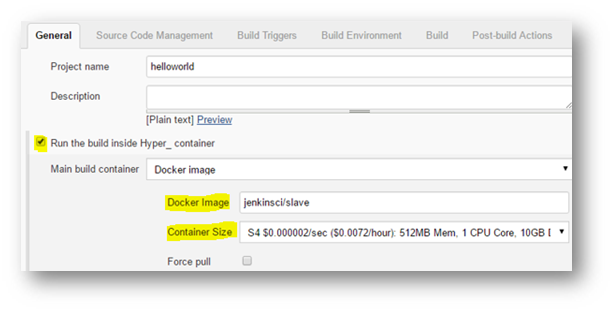
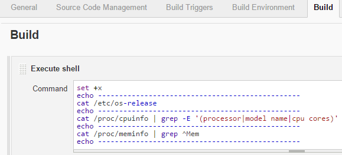
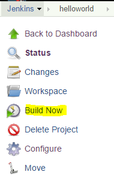
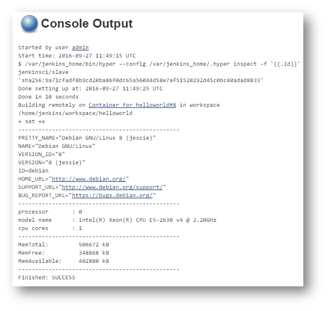
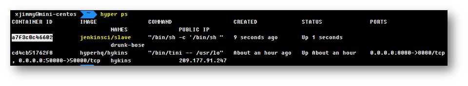
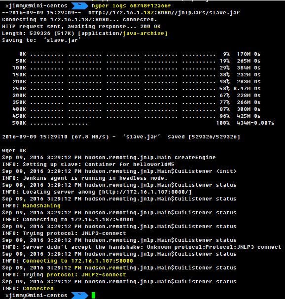

Hykins User Guide
=======================================================

Hykins is a ***serverless*** Jenkins distro optimized for containers. Currently, Hykins supports [hyper.sh](hyper.sh) as infrastructure provider, with more to be added easily.

<!-- TOC depthFrom:1 depthTo:6 withLinks:1 updateOnSave:1 orderedList:0 -->
- [What is Hykins](#what-is-hykins)
- [Why Hypkins](#why-hykins)
- [Quickstart](#quickstart)
	- [Setup](#setup)
	- [Deploy Hykins container](#deploy-hykins-container)
- [Prduction setup](#production-setup)
	- [Launch in production mode](#launch-in-production-mode)
	- [Unlock Jenkins](#unlock-jenkins)
- [Try a sample job](#try-a-sample-job)
	- [create helloworld job](#create-helloworld-job)
	- [trigger build](#trigger-build)
	- [view result](#view-result)
		- [console output](#console-output)
		- [Slave container info](#slave-container-info)
		- [Slave container log](#slave-container-log)
<!-- /TOC -->

# What is Hykins



# Why Hykins

# Quickstart

## Setup
First, you need to setup your account on [hyper.sh](hyper.sh):

- [Create an account](https://console.hyper.sh/register)
- [Provide your billing information and complete your account](https://console.hyper.sh/billing/credit)
- [Install `hyper` CLI on your laptop](https://docs.hyper.sh/GettingStarted/install.html)
- [Generate a credential and configure the CLI](https://docs.hyper.sh/GettingStarted/launch_the_first_container.html)

### Deploy Hykins container
There is a prebaked Docker image for [Hykins](https://hub.docker.com/r/hyperhq/hykins/) available in Docker Hub. You can simply pull the image to your Hyper_ account:

``` bash
$ hyper pull hyperhq/hykins
hyper pull hyperhq/hykins
Using default tag: latest
latest: Pulling from hyperhq/hykins

6a5a5368e0c2: Pull complete
7b9457ec39de: Pull complete
ff18e19c2db4: Pull complete
edd38215a2fa: Pull complete
5b26cafa72d5: Pull complete
f340301a2a0f: Pull complete
e8512ca75830: Pull complete
c76b0eeb6b4d: Pull complete
4e3006d37224: Pull complete
88ff00dc0e42: Pull complete
37d4b7b9d6e6: Pull complete
20cfdf921064: Pull complete
40bfe64a18ed: Pull complete
5edeed12b6b9: Pull complete
1f2bc7d49cb7: Pull complete
979d862d32a2: Pull complete
7a4f6028d1bc: Pull complete
3a73375f5728: Pull complete
a90e6b75bbcf: Pull complete
d888c6ccf803: Pull complete
271c606ae28e: Pull complete
40c348bd2d4b: Pull complete
8a8188eb6f90: Pull complete
0743fa347b1b: Pull complete
8b0445be40ea: Pull complete
096ea0e14f69: Pull complete
3958a11cb809: Pull complete
41211732e552: Pull complete
Digest: sha256:c4f725cd198dcca93e0b085086ea0829390db3313d49891c597b4abc2f1e86d8
Status: Downloaded newer image for hyperhq/hykins:latest
```

> **What's in the image?**
> `hyperhq/hykins` is based on `jenkins:latest`, with the following items installed:
> - `hyper` command line tools
> - `hyper-slaves-plugin` for Jenkins
> - Recommended plugins by Jenkins community
> You can find the Dockerfile [here](https://github.com/hyperhq/hykins/blob/master/Dockerfile).

To deploy Hykins in hyper.sh:
```
$ hyper run --name hykins -d -P \
  --size=m1 \
  -e ADMIN_USERNAME=xxxxx \
  -e ADMIN_PASSWORD=xxxxx \
  -e ACCESS_KEY=xxxxx \
  -e SECRET_KEY=xxxxx \
  hyperhq/hykins
```

> Notes:
> - By default, Hykins is launched in `development` mode. See [blow](#production-setup) to see how to run Hykins in production mode
> - In `development` mode, the recommended container size is `m1` (1GB)
> - `ADMIN_USERNAME`/ `ADMIN_PASSWORD` is for the Hykins admin account (default: `admin`/`nimda`)
> - `ACCESS_KEY`/ `SECRET_KEY` is the API credential of hyper.sh

Containers in hyper.sh come without public IP address by default. To enable Internet access, you need to request one and attach to the container:
```
$ FIP=`hyper fip allocate 1`
$ hyper fip attach $FIP hykins
```

# Production setup

## Launch in production mode
To run Hykins in production mode, use the following command:

```
$ hyper run --name hykins -d -P --size=m2 -e PRODUCTION=true \
  -e ACCESS_KEY=xxxxx -e SECRET_KEY=xxxx hyperhq/hykins
$ FIP=`hyper fip allocate 1`
$ hyper fip attach $FIP hykins
```
> Notes:
> - The recommended container size is `m2`(`2GB` memory)

## Unlock Jenkins
In Production Mode, you need to unlock Jenkins to be able to access:
- Open the web portal in your browser `http://${FIP}:8080`
- Setup Wizard` will prompt to ask for initial admin password
- run `hyper exec -it hykins cat /var/jenkins_home/secrets/initialAdminPassword`

------------------------------------------------------------------------------

# Try A Sample Job



## create helloworld job
```
//Step 1: create "Freestyle project" helloworld

//Step 2: check "Run the build inside Hyper_ container"
   - Docker Image: jenkinsci/slave
   - Container Size: S4
```



Other tested base images are:
 - openjdk:8-jdk
 - hyperhq/jenkins-slave-centos
 - hyperhq/jenkins-slave-golang:1.7-centos
 - hyperhq/jenkins-slave-golang:1.7-ubuntu

```
//Step 3: Add build step "Execute shell"
  - Command:
```

  

Here is the shell script:
```
set +x
echo ------------------------------------------------
cat /etc/os-release
echo ------------------------------------------------
cat /proc/cpuinfo | grep -E '(processor|model name|cpu cores)'
echo ------------------------------------------------
cat /proc/meminfo | grep ^Mem
echo ------------------------------------------------
```

## trigger build
Trigger build manually in this demo.


## view result

### console output


### Slave container info


### Slave container log

